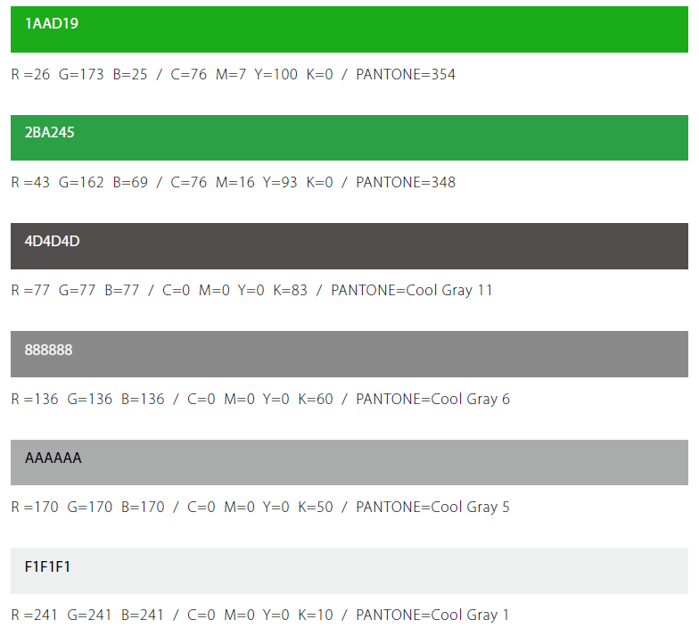

# 色彩标准

## 谷歌色系

* 蓝色\#4285F4   转换成  RGB: \(66,133,244\)
* 绿色\#34A853   转换成  RGB: \(52,168,83\)
* 黄色\#FBBC05  转换成  RGB:\(251,188,5\)
* 红色\#EA4335  转换成  RGB:\(234,67,53\)

## 微信色彩标准

核心色板

* 1AAD19

  R =26 G=173 B=25 / C=76 M=7 Y=100 K=0 / PANTONE=354

* 2BA245

  R =43 G=162 B=69 / C=76 M=16 Y=93 K=0 / PANTONE=348

* 4D4D4D

  R =77 G=77 B=77 / C=0 M=0 Y=0 K=83 / PANTONE=Cool Gray 11

* 888888

  R =136 G=136 B=136 / C=0 M=0 Y=0 K=60 / PANTONE=Cool Gray 6

* AAAAAA

  R =170 G=170 B=170 / C=0 M=0 Y=0 K=50 / PANTONE=Cool Gray 5

* F1F1F1

  R =241 G=241 B=241 / C=0 M=0 Y=0 K=10 / PANTONE=Cool Gray 1

[Wechat.design](https://wechat.design/)

## 红色

* 联想红: e12726
* 可口可乐logo红: e61d2b
* 可口可乐红: 9F2D20   /RGB：159 45 32  /LAB 37 474 36
* Leica的logo
  : ed1c24
* Huawei Red \(1987-2018\): ed1c24
* Verizon Red \(2000-2015\)
  : ec1c24

## 黑色

* 4d4d4d
* 1d1d1f

## 浅灰色

* f5f5f7
* 

